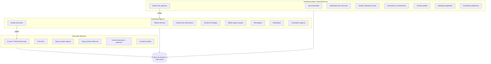
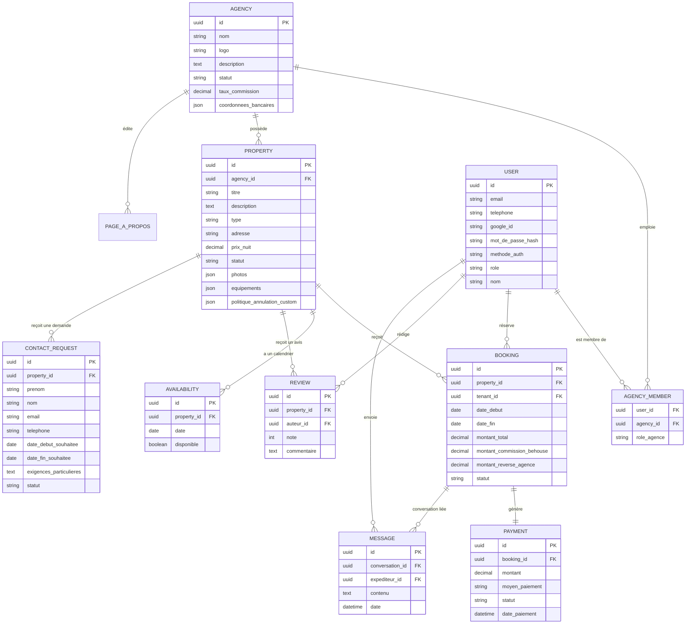
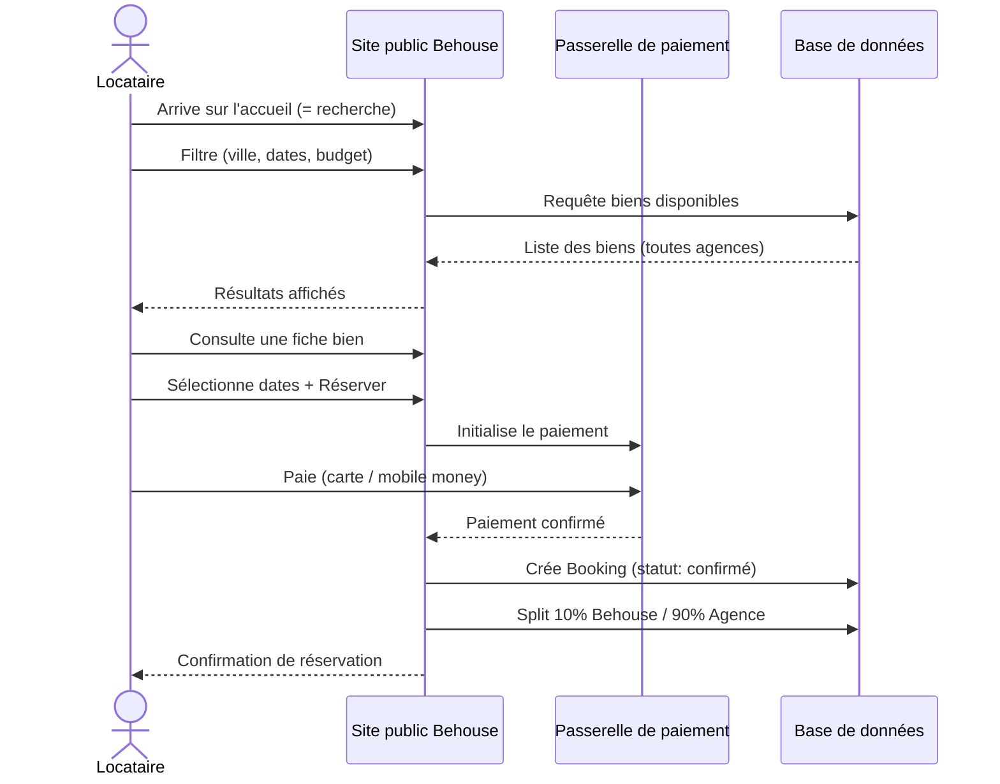
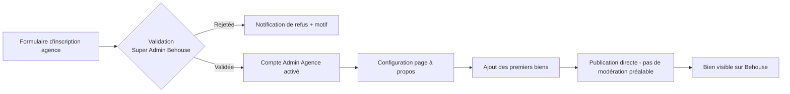
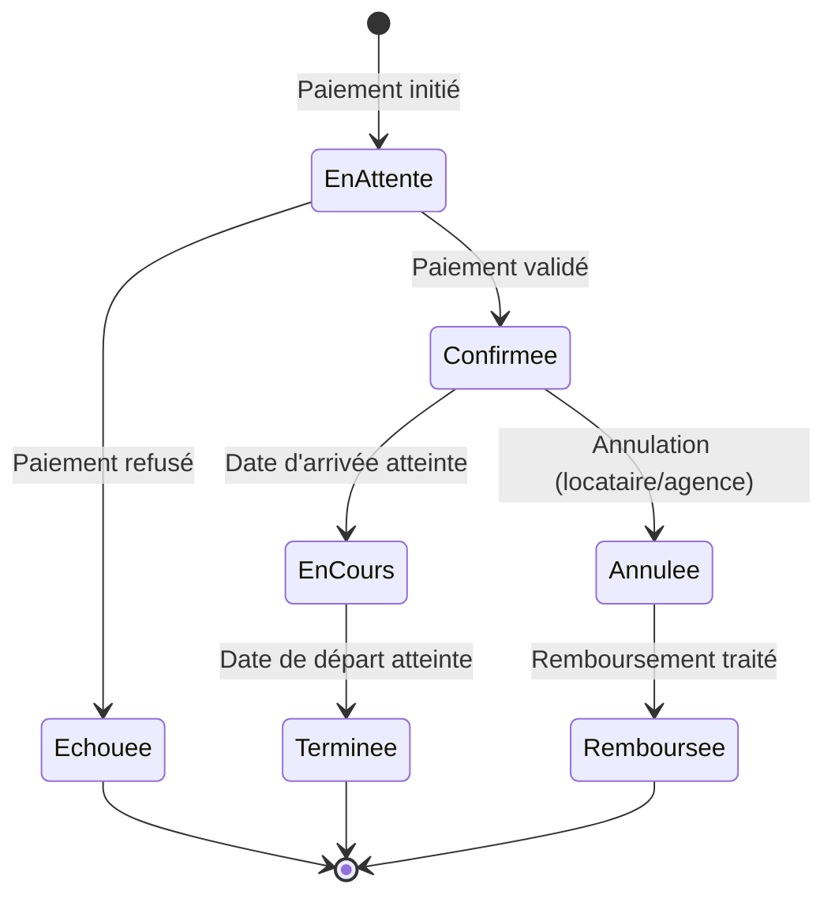
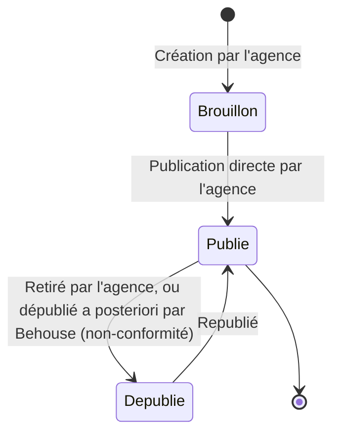
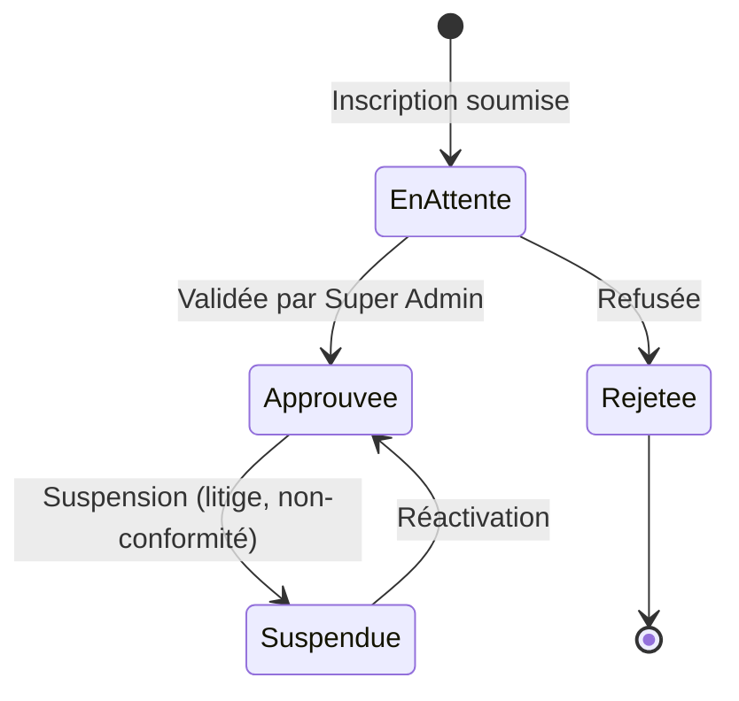

# BEHOUSE — Cahier des Charges Fonctionnel Détaillé (MVP)

**Version :** 1.2
**Date :** Septembre 2026
**Document de référence associé :** `Behouse_Documentation_Projet.md` (v0.4 — vision, acteurs, périmètre)
**Notation des diagrammes :** tous les schémas de ce document sont réalisés en **Mermaid** (blocs ` ```mermaid `), directement exploitables dans un README, un outil de conception, ou converti en image.

---

## 0. Rappel du périmètre MVP

- Location de **biens meublés** (courte/moyenne durée).
- **Multi-agences dès le lancement** : chaque agence a sa page à propos + son dashboard indépendant.
- **Commission Behouse : 10%** par réservation, split automatique au paiement (Behouse 10% / Agence 90%).
- **Page d'accueil = page de recherche/listing** (pas de vitrine séparée).
- **Hors périmètre :** relation agence ↔ propriétaire (Behouse ne gère que Agence ↔ Locataire ↔ Plateforme).

### Décisions actées (v1.1) — anciens points ouverts, désormais tranchés

| Sujet | Décision |
|---|---|
| **Modération des biens** | **Publication directe** par l'agence, sans validation préalable de Behouse. Le Super Admin garde un droit de dépublication a posteriori (modération réactive, pas systématique). |
| **Politique d'annulation** | **Une règle unique par défaut, valable pour tous les biens**, avec possibilité de la **surcharger bien par bien** si une agence le souhaite. Règle par défaut retenue (calquée sur The Flex) : voir section 6.2, "Politique d'annulation". |
| **Visibilité de la commission** | **La commission Behouse (10%) n'est jamais affichée au locataire.** Le locataire ne voit que le prix total (tout compris). |
| **Authentification** | **Trois méthodes disponibles** dès le MVP : (1) numéro de téléphone + mot de passe, (2) email + mot de passe, (3) connexion via Google (OAuth). |
| **Passerelle de paiement** | **CinetPay**, agrégateur retenu pour gérer MTN Mobile Money, Orange Money, et cartes Visa/Mastercard en un point d'intégration unique. |

> Ces décisions sont désormais reflétées dans les sections concernées (6, 9) et la section 10 (anciens "points ouverts") a été supprimée.

---

## 1. Glossaire

| Terme | Définition |
|---|---|
| **Agence** | Structure tierce inscrite sur Behouse, propriétaire de ses annonces. |
| **Bien** | Une annonce de logement meublé publiée par une agence. |
| **Réservation (Booking)** | Une demande de séjour payée par un locataire sur un bien, pour une période donnée. |
| **Split de paiement** | Répartition automatique d'un paiement entre Behouse (10%) et l'agence (90%). |
| **Tenant (locataire)** | Utilisateur final qui réserve un bien. À ne pas confondre avec "tenant" au sens technique multi-tenant. |
| **Super Admin** | Administrateur de la plateforme Behouse (vision globale). |
| **Admin Agence** | Administrateur d'une agence (vision restreinte à son agence). |

---

## 2. Diagramme d'architecture globale



---

## 3. Modèle de données — Diagramme Entité-Relation



---

## 4. Matrice des rôles & permissions

| Fonctionnalité | Visiteur | Locataire | Agent agence | Admin Agence | Super Admin Behouse |
|---|:---:|:---:|:---:|:---:|:---:|
| Rechercher / consulter un bien | ✅ | ✅ | ✅ | ✅ | ✅ |
| Réserver un bien | ❌ | ✅ | ❌ | ❌ | ❌ |
| Créer/modifier un bien | ❌ | ❌ | ✅* | ✅ | ✅ (modération) |
| Publier/dépublier un bien | ❌ | ❌ | ❌ | ✅ | ✅ (modération) |
| Voir les réservations de son agence | ❌ | ❌ | ✅ | ✅ | ✅ (toutes agences) |
| Gérer l'équipe de l'agence | ❌ | ❌ | ❌ | ✅ | ❌ |
| Éditer la page à propos agence | ❌ | ❌ | ❌ | ✅ | ✅ (modération) |
| Valider une inscription d'agence | ❌ | ❌ | ❌ | ❌ | ✅ |
| Voir les commissions globales | ❌ | ❌ | ❌ | ❌ (sa part uniquement) | ✅ |
| Modérer/suspendre une agence | ❌ | ❌ | ❌ | ❌ | ✅ |

*\* selon droits accordés par l'Admin Agence à l'agent.*

---

## 5. Diagrammes de flux (parcours utilisateurs)

### 5.1 Parcours Locataire — recherche → réservation → paiement



### 5.2 Parcours Agence — Onboarding



### 5.3 États d'une réservation (Booking)



### 5.4 États d'un bien (Property)

> Modération actée : **publication directe** (voir section 0) — l'étape de validation Behouse n'existe pas par défaut, seule la dépublication a posteriori est possible.



### 5.5 États d'une agence



---

## 6. Spécifications détaillées — Site public

### 6.1 Écran : Accueil / Recherche (page d'atterrissage unique)

**Référence :** calqué sur la page d'accueil de The Flex (image fournie), adapté au multi-agences.

**Objectif :** permettre à tout visiteur de trouver un bien meublé en quelques secondes, sans étape intermédiaire — la recherche EST la page d'accueil.

**Éléments d'interface — Header (barre du haut) :**
- Logo Behouse (à gauche), cliquable → retour à l'accueil.
- Sélecteur pays/ville (ex : "FR · PARIS") avec drapeau.
- Sélecteur de dates ("Dates").
- Sélecteur du nombre d'invités (compteur +/-, ex : "1 invité").
- Sélecteur de langue (ex : "FR · Français").
- Sélecteur de devise (ex : "£ GBP").
- Bouton **Connexion** (à droite).

**Éléments d'interface — Barre de filtres secondaire (sous le header) :**
- Bouton **Filtres** (ouvre un panneau de filtres avancés).
- Filtres rapides en chips cliquables : Wifi, Ascenseur, Parking, Climatisation, nombre de chambres (1/2/3...), nombre de salles de bain, Budget.

**Éléments d'interface — Corps de page (vue split écran) :**
- **Colonne gauche : liste des résultats**
  - Compteur : "*X* propriétés trouvées".
  - Grille de cartes bien (2 colonnes en desktop), chaque carte affichant :
    - Photo principale (carrousel léger si plusieurs photos disponibles au survol).
    - Badge prix en haut à droite de la photo : "£XXX,XX / par nuit".
    - Titre du bien (tronqué sur 1 ligne).
    - Ville.
    - Ligne résumé capacité : "1 Chambre • 1 Salle de bain • Jusqu'à 3 invités".
  - Scroll vertical indépendant de la carte (la liste défile sans bouger la carte).
- **Colonne droite : carte interactive**
  - Carte (Google Maps ou équivalent) centrée sur la zone recherchée.
  - Pins numérotés en cas de regroupement de plusieurs biens proches (clustering, ex : pin "10" = 10 biens dans cette zone), pins simples pour un bien isolé.
  - Zoom +/- , attribution cartographique en pied de carte.
  - Cliquer sur un pin met en évidence la carte bien correspondante dans la liste (et inversement).

**Adaptations spécifiques Behouse (vs modèle The Flex mono-marque) :**
- Chaque carte bien affiche en plus un **petit badge agence** (logo ou nom court de l'agence propriétaire), sans être intrusif — cohérent avec la section 6.2 sur la fiche bien détaillée.
- Le header n'inclut pas de menu "Propriétaires" (absent du périmètre Behouse, voir section 0) ; il peut en revanche inclure un lien discret type "Vous êtes une agence ? Rejoignez Behouse" pointant vers l'onboarding agence (section 7.1).

**Règles de gestion :**
- Seuls les biens au statut `Publié` et dont le calendrier a au moins une disponibilité pour la période recherchée apparaissent.
- Si aucune date n'est renseignée, afficher tous les biens publiés, triés par défaut (ex : popularité ou récence).
- Les filtres (chambres, salles de bain, équipements, budget) se combinent en ET logique.
- La liste et la carte restent synchronisées : le scroll de liste met à jour la zone visible de la carte (et vice-versa) — comportement standard de ce type d'interface, à confirmer en phase technique/UX.


### 6.2 Écran : Fiche bien

**Référence :** calqué sur la fiche bien de The Flex (images fournies), incluant les popups "Voir tous les équipements" et "Envoyer une demande".

**Objectif :** donner au locataire toutes les informations nécessaires pour décider de réserver, avec deux options de conversion : réservation instantanée ou demande de contact.

#### 6.2.1 Header

- Reprend le header complet du site (contrairement à la page d'accueil) : logo Behouse, menu **Emplacements**, **À propos**, **Contact**, sélecteur langue, sélecteur devise, bouton **Connexion**.
- *(Le menu "Propriétaires" présent chez The Flex n'existe pas côté Behouse — voir section 0, hors périmètre. Un lien "Carrières" peut être conservé ou retiré selon la stratégie éditoriale de Behouse.)*

#### 6.2.2 Galerie photos

- Bloc de 5 photos en grille : 1 grande photo à gauche + 4 photos plus petites à droite (2x2).
- Bouton **"Voir toutes les photos"** en surimpression sur la dernière vignette → ouvre une galerie complète (lightbox, hors périmètre détaillé ici, comportement standard).

#### 6.2.3 En-tête de la fiche

- Titre du bien (ex : "Élégant Appartement 1 Chambre à Levallois-Perret").
- Ligne d'icônes résumant la capacité : nombre d'invités, nombre de chambres, nombre de salles de bain, nombre de lits, équipement structurant mis en avant (ex : "Avec Ascenseur").
- **Badge agence** (adaptation Behouse) : nom + logo de l'agence propriétaire, avec lien vers sa page à propos (section 6.3) — positionné near le titre ou en complément de la ligne d'icônes, à préciser en wireframe.

#### 6.2.4 Bloc "À propos de cette propriété"

- Texte descriptif, tronqué avec lien **"Lire plus"** pour déplier le texte complet.

#### 6.2.5 Bloc "Équipements" (aperçu + popup détaillée)

- **Aperçu sur la fiche :** grille de 6 à 9 équipements les plus notables (icône + libellé), ex : WiFi, Cuisine, Chauffage, Buanderie, TV, Smart TV, Shower, Iron, Cable TV.
- Bouton **"Voir tous les équipements →"** en haut à droite du bloc, ouvrant la popup détaillée.

**→ Popup "Tous les équipements" :**
- Fenêtre modale (fond assombri, croix de fermeture en haut à droite).
- Titre : "Tous les équipements".
- Contenu organisé par **catégories**, chacune avec un intitulé et une grille à 2 colonnes d'équipements (icône + libellé) :
  - *Living room* (ex : Cable TV, Private Living Room)
  - *Internet & office* (ex : WiFi ×plusieurs variantes possibles si plusieurs box/zones)
  - *Kitchen & dining* (ex : Cuisine, Toaster, Micro-Ondes, Oven, Electric Kettle, Stove...)
  - *(autres catégories possibles selon le bien : Salle de bain, Chambre, Extérieur, Sécurité...)*
- Contenu scrollable verticalement à l'intérieur de la popup si la liste est longue.
- **Règle de gestion :** ces équipements sont saisis/catégorisés par l'agence lors de la création/édition du bien (section 7.3) — prévoir une **liste de référence d'équipements pré-catégorisés** (catalogue commun à toutes les agences) plutôt que du texte libre, pour garantir la cohérence d'affichage et permettre le filtrage sur la page de recherche (section 6.1).

#### 6.2.6 Encart de réservation (colonne droite, sticky)

- Titre : "Réservez votre séjour" + sous-titre "Sélectionnez les dates pour voir les prix".
- Champ **Sélectionner les dates** (ouvre un calendrier avec les dates bloquées grisées).
- Champ **nombre d'invités** (compteur).
- Bouton principal **"Vérifier la disponibilité"** (désactivé tant qu'aucune date n'est choisie) → mène au tunnel de réservation (section 6.5).
- Bouton secondaire **"Envoyer une demande"** (toujours actif) → ouvre la popup de demande de contact (voir 6.2.6 bis).
- Mention "Confirmation de réservation instantanée" sous les boutons, pour rassurer sur la rapidité du processus.

**Règle de gestion :** le prix n'est affiché qu'une fois des dates sélectionnées (prix total pour le séjour, **tout compris**, sans détail de la commission Behouse — voir décision actée en section 0).

#### 6.2.6 bis — Popup "Envoyer une demande"

- Fenêtre modale, titre/consigne : "Remplissez le formulaire ci-dessous et nous vous répondrons sous peu".
- Champs du formulaire :
  - **Prénom** / **Nom** (deux champs côte à côte).
  - **E-mail**.
  - **Téléphone** : sélecteur d'indicatif pays + numéro.
  - **Dates du séjour** *(optionnel)* : sélecteur de dates.
  - **Exigences particulières** *(optionnel)* : zone de texte libre.
- Bouton de soumission (en bas, hors du cadre visible sur la capture — à prévoir : "Envoyer la demande").
- **Règle de gestion :** cette demande crée une entrée qui doit apparaître dans la messagerie/les leads du dashboard agence (section 7.4/7.7), même si l'utilisateur n'est pas connecté — utile pour capter des locataires hésitants qui ne veulent pas payer immédiatement.

#### 6.2.7 Bloc "Politiques de séjour"

- **Arrivée & Départ** : heure d'arrivée (ex : 15h00) et heure de départ (ex : 10h00), éditables par l'agence.
- **Règles de la maison** : grille d'icônes/libellés (ex : Interdiction de fumer, Animaux interdits, Pas de fêtes ou d'événements, Caution requise) — cochées/décochées par l'agence à la création du bien.
- **Politique d'annulation** *(règle unique par défaut, surchargeable par bien — voir décision section 0)* :
  - *Pour les séjours de moins de 28 jours* : remboursement complet jusqu'à 14 jours avant l'arrivée ; aucun remboursement en dessous de 14 jours avant l'arrivée.
  - *Pour les séjours de 28 jours ou plus* : remboursement complet jusqu'à 30 jours avant l'arrivée ; aucun remboursement en dessous de 30 jours avant l'arrivée.

#### 6.2.8 Bloc "Emplacement"

- Carte avec un pin centré sur l'adresse du bien (position approximative pour préserver la confidentialité avant réservation, à confirmer en phase produit).
- Lien "Open in Maps" pour ouvrir dans Google Maps.

#### 6.2.9 Lien de découverte

- Lien de type "Découvrez plus d'appartements à [type de séjour] à [Ville]" → renvoie vers la page de recherche (6.1) filtrée sur la ville.

#### 6.2.10 Footer

- Bloc newsletter ("Rejoignez Behouse" — prénom, nom, email, téléphone, bouton "S'abonner").
- Colonnes de liens : à propos de Behouse (Blog, Carrières, Termes et Conditions, Politique de confidentialité), Emplacements (villes couvertes), Nous contacter (téléphones par pays, email support).
- Réseaux sociaux, copyright.

**Règles de gestion générales de la fiche bien :**
- Le calendrier ne permet pas de sélectionner des dates déjà réservées ou bloquées par l'agence.
- La commission Behouse (10%) n'apparaît jamais dans l'interface locataire (ni sur la fiche, ni dans le tunnel de réservation) — voir section 0.


### 6.3 Écran : Page "à propos" par agence

**Objectif :** vitrine publique de l'agence, gage de confiance pour le locataire.

**Éléments d'interface :**
- Logo, nom de l'agence, bannière/photo de couverture.
- Description / présentation (texte libre édité par l'agence).
- Zone(s) de couverture (villes/quartiers où l'agence opère).
- Note moyenne de l'agence (calculée à partir des avis biens, si applicable).
- Liste de tous les biens actifs de l'agence (grille similaire à la page recherche, filtrée sur cette agence).
- Coordonnées de contact publiques (optionnel, selon ce que l'agence souhaite afficher).

**Règles de gestion :**
- Le contenu est entièrement édité par l'Admin Agence depuis son dashboard (section 7.5).
- Behouse peut modérer/masquer une page à propos en cas de contenu non conforme (droit du Super Admin).

### 6.4 Écran : Page "à propos" Behouse (globale)

**Objectif :** présenter la plateforme elle-même (mission, fonctionnement, garanties).

**Éléments d'interface :** contenu éditorial géré depuis le dashboard Behouse (module "Contenu global", section 8.6) — texte, images, éventuellement chiffres clés (nombre d'agences, de biens, de villes couvertes).

### 6.5 Tunnel de réservation + paiement

**Objectif :** convertir la sélection de dates en réservation payée, en un minimum d'étapes. Deux parcours coexistent (voir 6.2.6) : **réservation instantanée** (paiement immédiat) et **demande de contact** (sans paiement, traitée par l'agence).

**Étapes du parcours "réservation instantanée" :**
1. Sélection des dates sur la fiche bien → clic "Vérifier la disponibilité" → récapitulatif (nb nuits, prix total, tout compris — sans détail de commission).
2. Connexion/inscription si le locataire n'est pas encore authentifié, via l'une des **trois méthodes actées** : (a) téléphone + mot de passe, (b) email + mot de passe, (c) connexion Google (OAuth).
3. Récapitulatif final (bien, dates, prix, conditions d'annulation applicables — règle par défaut ou règle spécifique au bien, voir 6.2.7).
4. Paiement en ligne : choix du moyen de paiement parmi **MTN Mobile Money, Orange Money, ou carte Visa/Mastercard**, via **CinetPay**.
5. Écran de confirmation + email/SMS de confirmation automatique.

**Étapes du parcours "Envoyer une demande" :** voir popup détaillée en 6.2.6 bis — ce parcours n'implique aucun paiement, il crée simplement une demande à traiter par l'agence (dashboard agence, section 7.4/7.7), avec réponse manuelle.

**Règles de gestion :**
- Le split 10%/90% est déclenché automatiquement à la confirmation du paiement (voir diagramme 5.1), quel que soit le moyen de paiement utilisé.
- En cas d'échec de paiement, le Booking passe au statut `Échouée` (voir diagramme 5.3) et aucune date n'est bloquée sur le calendrier du bien.
- L'agrégateur de paiement retenu est **CinetPay**. CinetPay expose une API de collecte de paiement (Mobile Money + carte) mais **ne propose pas nativement un split marketplace multi-bénéficiaires** comme Stripe Connect — le mécanisme technique exact de reversement des 90% à l'agence (transfert CinetPay vers compte agence si disponible, ou reversement par lot piloté depuis le dashboard Behouse) est **à valider précisément lors de l'intégration technique** (voir documentation technique dédiée).

### 6.6 Compte locataire

**Éléments d'interface :**
- **Mes réservations** : liste (à venir / passées), détail par réservation, statut, possibilité d'annulation selon règles.
- **Mes favoris** : biens enregistrés pour consultation ultérieure.
- **Mes messages** : conversations avec les agences (module V1).
- **Mon profil** : informations personnelles, moyens de paiement enregistrés (selon passerelle).

---

## 7. Spécifications détaillées — Dashboard Agence

### 7.1 Onboarding / Inscription agence

**Éléments du formulaire :**
- Nom de l'agence, email professionnel, téléphone.
- Documents légaux (à définir précisément selon juridiction — ex : registre de commerce).
- Coordonnées bancaires (pour recevoir les 90% des paiements).
- Mot de passe du compte Admin Agence.

**Règles de gestion :**
- Statut initial : `En attente`.
- Le compte Admin Agence n'est activé qu'après validation par le Super Admin (voir diagramme 5.2 et 5.5).
- Email de notification à chaque changement de statut (approuvée / rejetée).

### 7.2 Tableau de bord agence

**Éléments d'interface :**
- Indicateurs clés : réservations en cours, revenus du mois (après commission), taux d'occupation moyen, messages non lus.
- Liste des dernières réservations.
- Alertes (ex : bien sans disponibilité mise à jour depuis longtemps, document manquant).

### 7.3 Gestion des biens

**Liste des biens :**
- Tableau avec titre, statut (Brouillon / Publié / Dépublié), prix, nombre de réservations, actions rapides.

**Création/Édition d'un bien :**
- Titre, description, type de bien, adresse (avec géolocalisation), capacité.
- Photos (upload multiple, réordonnable).
- Équipements (liste à cocher).
- Prix par nuit (+ éventuelles règles de tarification : prix week-end, tarif dégressif long séjour — V1).
- Calendrier de disponibilité (bloquer/débloquer des dates manuellement).
- Politique d'annulation : réglée par défaut sur la règle unique plateforme (section 6.2.7), avec option "Personnaliser pour ce bien" si l'agence souhaite la surcharger.
- Bouton **"Publier"** → publication directe et immédiate (pas d'étape de modération préalable, voir section 0 et diagramme 5.4).

**Règles de gestion :**
- Un bien ne peut pas être publié sans au moins 1 photo, un prix, et une adresse valide.
- Voir cycle de vie complet en diagramme 5.4.

### 7.4 Gestion des réservations

**Éléments d'interface :**
- Liste des réservations (filtrable par statut, par bien, par période).
- Détail d'une réservation : locataire, dates, montant total, montant reversé à l'agence, statut.
- Actions : confirmer (si validation manuelle activée), annuler, contacter le locataire.

### 7.5 Gestion de l'équipe

**Éléments d'interface :**
- Liste des membres de l'agence avec leur rôle.
- Invitation par email d'un nouvel agent.
- Définition des droits par agent (ex : gestion biens seule / gestion biens + réservations).

### 7.6 Édition de la page à propos

**Éléments d'interface :**
- Upload logo / bannière.
- Champ description (éditeur de texte enrichi).
- Zones de couverture (sélection de villes/quartiers).
- Coordonnées de contact publiques (toggle affichage).
- Aperçu en direct de la page publique avant publication.

### 7.7 Messagerie (V1)
Interface de conversation classique (liste de conversations à gauche, fil de discussion à droite), liée à une réservation ou à une demande de contact.

### 7.8 Statistiques agence
Graphiques : évolution des revenus, taux d'occupation par bien, biens les plus performants, répartition des sources de réservation (si pertinent).

### 7.9 Paramètres agence
Informations légales, coordonnées bancaires, gestion du mot de passe/sécurité du compte Admin Agence, préférences de notification.

---

## 8. Spécifications détaillées — Dashboard Admin Global Behouse

### 8.1 Vue d'ensemble
Indicateurs globaux : nombre d'agences actives, nombre de biens publiés, volume de réservations (période sélectionnable), revenus Behouse (somme des commissions 10%), graphique d'évolution.

### 8.2 Gestion des agences
- Liste des agences avec statut (`En attente`, `Approuvée`, `Suspendue`, `Rejetée`).
- Fiche détail d'une agence : informations d'inscription, documents fournis, biens publiés, historique de réservations, revenus générés.
- Actions : **Approuver**, **Rejeter** (avec motif), **Suspendre**, **Réactiver**.

### 8.3 Modération des annonces
- **Publication directe** actée (voir section 0) : les biens créés par une agence sont publiés immédiatement, sans file d'attente de validation.
- Le Super Admin garde un droit de **dépublication a posteriori** en cas de contenu non conforme.
- Liste des signalements (biens signalés par des locataires — fonctionnalité V1).

### 8.4 Gestion des utilisateurs finaux
- Recherche/consultation des comptes locataires.
- Historique de réservations d'un utilisateur.
- Gestion des litiges (accès aux messages/réservations concernées, actions de remboursement si nécessaire).

### 8.5 Facturation & commissions
- Vue consolidée des commissions perçues, par agence et par période.
- Export comptable (CSV/PDF — à préciser en phase technique).
- Suivi des paiements en attente / effectués vers les agences.

### 8.6 Contenu global
- Édition de la page "à propos Behouse".
- Mise en avant de biens/agences sur la page d'accueil (sélection manuelle ou automatique selon critères).

### 8.7 Statistiques globales
Tableaux de bord analytiques : croissance du nombre d'agences, volume de réservations dans le temps, taux de conversion recherche → réservation, répartition géographique.

### 8.8 Paramètres plateforme
- Taux de commission par défaut (10%), avec possibilité de taux personnalisé par agence (champ `taux_commission` déjà prévu en base — section 3).
- Règles de modération (activer/désactiver la validation systématique des biens).
- Gestion des CGU / mentions légales affichées sur le site public.
- Gestion des comptes collaborateurs internes Behouse (si plusieurs personnes gèrent le dashboard global).

---

## 9. Règles de gestion transverses

| Règle | Détail |
|---|---|
| **Calcul de la commission** | `montant_commission_behouse = montant_total × 10%` ; `montant_reverse_agence = montant_total × 90%`. Calculé et figé au moment de la confirmation du paiement (pas de recalcul rétroactif si le taux plateforme change ensuite). Jamais affiché au locataire. |
| **Visibilité multi-tenant** | Toute requête dans le dashboard agence est systématiquement filtrée par `agency_id` de l'utilisateur connecté — jamais d'accès croisé entre agences. |
| **Modération** | **Publication directe** par l'agence (pas de validation préalable systématique) ; le Super Admin peut dépublier a posteriori en cas de non-conformité. |
| **Annulation** | Règle **unique par défaut** au niveau plateforme (voir 6.2.7 : <28 jours vs ≥28 jours), **surchargeable bien par bien** par l'agence. |
| **Authentification** | Trois méthodes supportées : téléphone + mot de passe, email + mot de passe, Google OAuth. |
| **Paiement** | **CinetPay** : MTN Mobile Money, Orange Money, cartes Visa/Mastercard. Reversement agence (90%) géré par lot depuis le dashboard Behouse tant que le split natif n'est pas confirmé côté CinetPay. |
| **Notifications** | Email/SMS obligatoire à chaque changement de statut clé (réservation confirmée/annulée, agence approuvée/rejetée, bien dépublié). |

---

## 10. Prochaines étapes

1. ~~Trancher les points ouverts (modération, annulation, commission visible, authentification, paiement)~~ ✅
2. Dashboard agence et dashboard Behouse : périmètre fonctionnel basé sur les sections 7 et 8 (design/maquettes à affiner ultérieurement, non bloquant pour la suite).
3. ~~Choisir l'agrégateur de paiement~~ ✅ CinetPay — reste à valider précisément le mécanisme de reversement (90%) aux agences lors de l'intégration technique.
4. Produire la **documentation technique** (stack, architecture, intégration CinetPay) et le **planning de développement** — objet du document suivant.

---

*Fin du cahier des charges fonctionnel détaillé v1.2 — toutes les décisions produit sont actées. Passage à la documentation technique et au planning de développement.*
