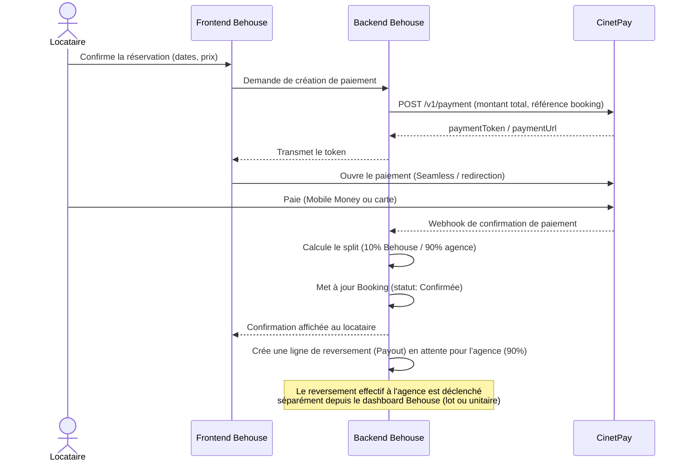
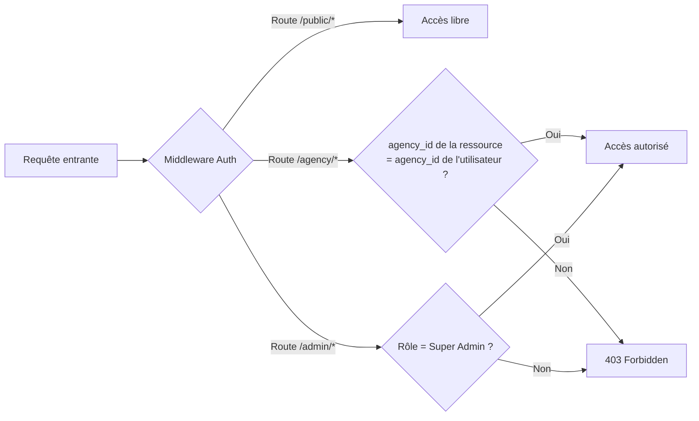
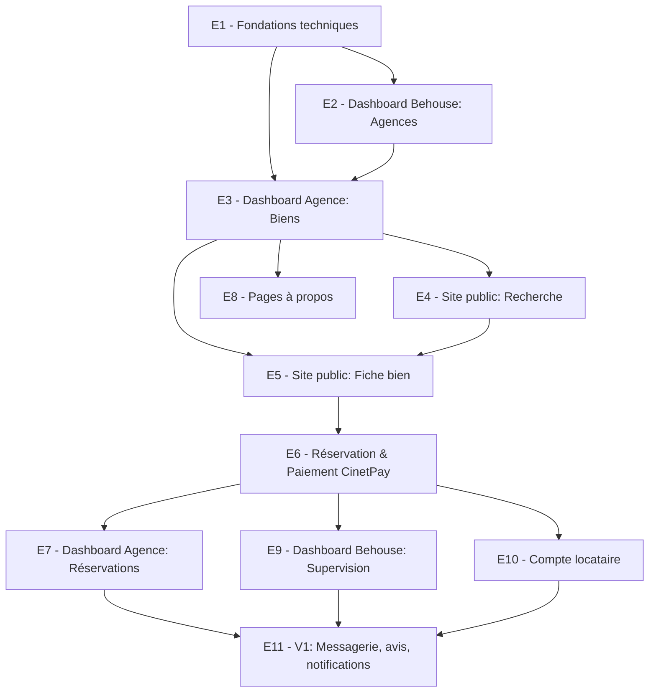
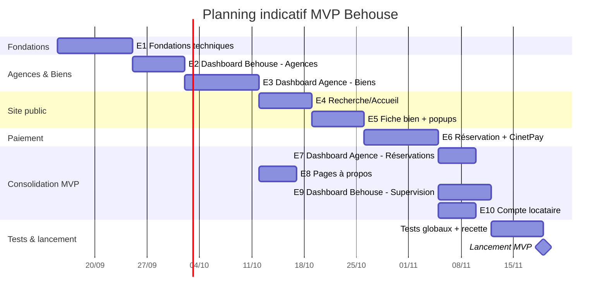

# BEHOUSE — Documentation Technique & Planning de Développement

**Version :** 1.2
**Date :** Septembre 2026
**Documents de référence associés :**
- `Behouse_Documentation_Projet.md` (vision, acteurs, périmètre)
- `Behouse_Cahier_Des_Charges_Fonctionnel.md` (spécifications fonctionnelles détaillées)

**Notation des diagrammes :** Mermaid, comme dans le document précédent.

---

## 1. Objectif de ce document

Traduire le cahier des charges fonctionnel en **choix techniques concrets** et en **plan d'exécution** (découpage en epics/tickets, ordre de développement), pour permettre un développement assisté par IA rapide et structuré.

---

## 2. Stack technique proposée

> Ces choix sont une proposition raisonnable et éprouvée pour ce type de plateforme (marketplace multi-tenant avec paiement). Ils restent à valider/ajuster selon vos contraintes (budget hébergement, compétences internes, délais).

| Couche | Choix retenu | Justification |
|---|---|---|
| **Frontend (site public + dashboards)** | **Next.js (React) + TypeScript strict** | Rendu hybride (SEO pour le site public, SPA fluide pour les dashboards), écosystème riche, bon support de l'IA pour générer du code rapidement. Déployé sur **Vercel**. |
| **Style / UI** | **Tailwind CSS** + composants réutilisables | Développement rapide, cohérent avec un design system évolutif. |
| **Backend / API** | **NestJS (Node.js) + TypeScript strict** | Architecture modulaire (modules/services/guards) bien adaptée au multi-tenant applicatif (scoping par `agency_id`), typage fort de bout en bout. Déployé sur **Render.com**. |
| **Base de données** | **PostgreSQL managé sur Neon** (`behouse_db`) | Relationnel, fiable, gère bien les contraintes multi-tenant (index sur `agency_id`), branching de base de données pratique pour les environnements de test. ORM : **Prisma** (typage généré automatiquement, évite le recours à `any`). |
| **Stockage fichiers (photos)** | **Neon Storage (compatible S3)** | Retenu pour rester sur un seul fournisseur (base de données + stockage) plutôt que d'ajouter Cloudflare R2 comme prévu initialement — simplifie la facturation et la gestion des accès. Interface S3 standard, donc les SDK S3 habituels (`@aws-sdk/client-s3`) fonctionnent sans changement. |
| **Authentification** | Système interne (email/mdp, téléphone/mdp) + **Google OAuth 2.0** | Couvre les 3 méthodes actées (cahier des charges, section 0). |
| **Paiement** | **CinetPay** (API de collecte) | Retenu pour MTN Mobile Money, Orange Money, cartes Visa/Mastercard. **Behouse encaisse la totalité du paiement puis reverse les 90% à l'agence** (voir section 4) — ce choix évite tout retard ou dépendance à un mécanisme de split natif tiers. |
| **Notifications** | Email via un service transactionnel (ex : Resend, SendGrid, ou Brevo) + SMS via un agrégateur SMS local | Confirmations de réservation, validations agences, etc. |
| **Cartographie** | **Google Maps API** (ou Mapbox en alternative moins coûteuse à volume élevé) | Cohérent avec les maquettes de référence (calques Google Maps visibles). |
| **Conteneurisation** | **Docker** — mis en place **en fin de projet**, une fois le MVP fonctionnel, pour fiabiliser les déploiements et environnements locaux. | Ne bloque pas le démarrage du développement. |
| **CI/CD** | GitHub Actions (lint, typecheck, build, tests) + déploiement continu natif **Vercel** (frontend) et **Render** (backend) | Chaque service se déploie automatiquement sur push, GitHub Actions sert de garde-fou qualité avant merge. |
| **Gestion de projet** | Voir section 10 (recommandation) | — |

---

## 3. Architecture technique — vue d'ensemble

```mermaid
flowchart TB
    subgraph Client["Clients"]
        Web[Site public + Dashboards\n(Next.js)]
    end

    subgraph Backend["Backend API"]
        API[API REST/GraphQL]
        Auth[Service Authentification\nemail/tel + Google OAuth]
        Booking[Service Réservations]
        Payment[Service Paiement\nintégration CinetPay]
        Notif[Service Notifications\nEmail/SMS]
    end

    subgraph Data["Stockage"]
        DB[(PostgreSQL - Neon\nmulti-tenant via agency_id)]
        S3[(Neon Storage\ncompatible S3 - photos des biens)]
    end

    subgraph External["Services externes"]
        CinetPay[CinetPay\nMobile Money / Carte]
        Maps[Google Maps API]
        Mail[Service Email/SMS]
    end

    Web --> API
    API --> Auth
    API --> Booking
    API --> Payment
    API --> Notif
    API --> DB
    API --> S3
    Payment --> CinetPay
    Notif --> Mail
    Web --> Maps
```

---

## 4. Intégration CinetPay — flux détaillé



**Points d'attention techniques (à valider en amont du développement) :**
1. **Modèle de reversement retenu : encaissement total + reversement différé.** Behouse encaisse 100% du paiement via CinetPay, puis reverse les 90% à l'agence par un mécanisme de paiement séparé (virement/mobile money déclenché depuis le dashboard Behouse, en lot ou à la demande). Ce choix a été fait volontairement pour **garder le contrôle du timing des reversements** (éviter tout retard subi en cas de remboursement/litige sur une réservation) plutôt que de dépendre d'un split automatique tiers.
2. **Webhooks** : le backend doit exposer un endpoint sécurisé (vérification de signature) pour recevoir les confirmations de paiement CinetPay de façon fiable, même si l'utilisateur ferme son navigateur avant la redirection finale.
3. **Idempotence** : chaque `Booking` doit avoir une référence unique transmise à CinetPay, pour éviter les doubles confirmations en cas de webhook renvoyé plusieurs fois.
4. **Devises** : si Behouse opère dans plusieurs pays (XOF, XAF, etc.), vérifier la couverture multi-devise de CinetPay dès la phase de cadrage technique.
5. **Reversement agence** : prévoir dans le modèle de données un statut de reversement (`Payout`) distinct du `Payment` du locataire — ex : `Payout(agency_id, booking_ids[], montant, statut: en_attente/effectué, date)` — pour tracer précisément ce que Behouse doit à chaque agence et ce qui a déjà été versé.

---

## 5. Multi-tenance applicative (agences)

**Principe retenu (cohérent avec le cahier des charges, section 3 et 6) :** un seul schéma de base de données, isolation logique par `agency_id`.

**Règles d'implémentation :**
- Chaque requête émise depuis le **dashboard agence** est automatiquement filtrée côté backend par l'`agency_id` de l'utilisateur authentifié — jamais côté frontend seul (sécurité).
- Les endpoints de l'API distinguent clairement les routes "scopées agence" (`/agency/*`) des routes "globales Behouse" (`/admin/*`) et des routes "publiques" (`/public/*`).
- Un middleware d'autorisation vérifie, à chaque requête sur `/agency/*`, que la ressource demandée (bien, réservation...) appartient bien à l'agence de l'utilisateur connecté.



---

## 6. Environnements & déploiement

| Environnement | Usage | Notes |
|---|---|---|
| **Développement (local)** | Poste des développeurs | Base de données locale ou conteneurisée (Docker). |
| **Staging (recette)** | Tests avant mise en production, validation client | Intégration CinetPay en **mode sandbox/test**. |
| **Production** | Environnement live | Intégration CinetPay en **mode production**, monitoring actif. |

**Recommandations :**
- Conteneuriser l'application (Docker) dès le départ pour fiabiliser le passage dev → staging → prod.
- Mettre en place un pipeline CI/CD simple : tests automatiques → build → déploiement staging → validation manuelle → déploiement production.
- Prévoir des sauvegardes automatiques quotidiennes de la base de données dès la mise en production (données de paiement et de réservation critiques).

---

## 7. Planning de développement

### 7.1 Découpage en Epics (repris du cahier des charges, sections 6-8)

| # | Epic | Contenu résumé |
|---|---|---|
| E1 | Fondations techniques | Setup projet, CI/CD, base de données, authentification (3 méthodes) |
| E2 | Dashboard Behouse — Agences | Onboarding, validation, gestion agences (cahier des charges 7.1, 8.2) |
| E3 | Dashboard Agence — Biens | CRUD biens, calendrier, équipements, photos (7.3) |
| E4 | Site public — Recherche | Accueil/recherche, filtres, carte interactive (6.1) |
| E5 | Site public — Fiche bien | Fiche bien, popups équipements/demande (6.2) |
| E6 | Réservation & Paiement | Tunnel de réservation, intégration CinetPay, split commission (6.5, section 4 de ce document) |
| E7 | Dashboard Agence — Réservations | Gestion des réservations, statistiques de base (7.4, 7.8) |
| E8 | Page à propos — Agence & Behouse | Pages vitrines publiques + édition (6.3, 6.4, 7.6) |
| E9 | Dashboard Behouse — Supervision | Vue d'ensemble, commissions, contenu global (8.1, 8.5, 8.6) |
| E10 | Compte locataire | Mes réservations, favoris (6.6) |
| E11 *(V1)* | Messagerie, avis, notifications avancées | Modules V1 du cahier des charges |

### 7.2 Ordre de développement recommandé



**Logique du séquençage :**
1. On ne peut pas afficher de biens publics (E4/E5) tant qu'il n'existe pas de mécanisme pour en créer (E3), qui lui-même dépend d'avoir des agences (E2).
2. Le paiement (E6) est délibérément après la fiche bien (E5) car il en dépend directement (bouton "Vérifier la disponibilité").
3. Les dashboards de supervision (E7, E9) et le compte locataire (E10) peuvent être développés en parallèle une fois E6 posé, car ils consomment des données déjà produites par les étapes précédentes.
4. Le module V1 (E11) n'est volontairement pas dans le MVP initial.

### 7.3 Planning indicatif (Gantt)

> Estimation indicative uniquement — à ajuster une fois l'équipe de développement (taille, expérience avec l'IA) connue. Basé sur un développement assisté par IA avec 1 à 2 développeurs.



**Durée indicative totale du MVP : environ 10 à 12 semaines**, avec du parallélisme possible sur certains epics (E8 peut démarrer en même temps que E4/E5 par exemple) si plusieurs développeurs/agents IA travaillent en parallèle.

---

## 8. Définition de "Terminé" (Definition of Done) pour chaque epic

Pour qu'un epic soit considéré comme terminé et prêt pour la recette :
- Toutes les fonctionnalités listées dans le cahier des charges pour cet écran sont implémentées.
- Les règles de gestion associées sont respectées (ex : scoping multi-tenant, calcul de commission).
- Un jeu de données de test permet de démontrer le parcours complet.
- Pas d'erreur bloquante en environnement de staging.
- Revue rapide par rapport aux maquettes de référence (quand elles existent — site public) ou à la structure fonctionnelle définie (dashboards, sections 7-8).

---

## 9. Outil de gestion de projet

**Décision actée : Jira.**

Les epics définis en section 7.1 (E1 à E11) sont directement transposables en **Epics Jira**, avec les tickets/sous-tâches détaillés dans le cahier des charges fonctionnel comme user stories.

---

## 10. Prochaines étapes

1. ~~Valider les choix de stack technique~~ ✅ Next.js + NestJS + Neon (PostgreSQL) + Cloudflare R2 + CinetPay + Vercel + Render.
2. ~~Confirmer le mécanisme de reversement CinetPay~~ ✅ Encaissement total par Behouse + reversement différé (90%) piloté depuis le dashboard.
3. **Initialiser le monorepo** (structure `apps/web` + `apps/api`) et le **CI/CD** — voir livrable de code associé à ce message.
4. Configurer Neon (`behouse_db`), Cloudflare R2 (`behouse_storage`), Vercel (projet `apps/web`) et Render (service `apps/api`) avec les variables d'environnement.
5. Démarrer le développement fonctionnel par **E1 — Fondations techniques** (schéma Prisma initial, authentification).

---

*Fin de la documentation technique et du planning de développement v1.1 — stack et hébergement confirmés, initialisation du projet en cours (voir livrable de code).*
